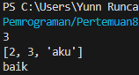
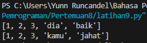

# Latihan 9 Bahasa Pemrograman
## Buat sebuah list sebanyak 5 elemen dengan nilai bebas
### Akses list:
* Tampilkan elemen ke 3
* Ambil nilai elemen ke 2 sampai elemen ke 4
* Ambil elemen terakhir

## Programnya
``````python
list = []
list = [1, 2, 3, "aku", "baik"]
print(list[2])
print(list[1:4])
print(list[4])
``````
### Outputnya :



### Ubah elemen list:
* Ubah elemen ke 4 dengan nilai lainnya
* Ubah elemen ke 4 sampai dengan elemen terakhir

## Programnya
``````python
list = [1, 2, 3, "aku", "baik"]
list[3] = "dia"
print(list)
list[3:5] = ["kamu" , "jahat"]
print(list)
``````
### Outputnya :



### Tambah elemen list:
* Ambil 2 bagian dari list pertama (A) dan jadikan list ke 2 (B)
* Tambah list B dengan nilai string
* Tambah list B dengan 3 nilai
* Gabungkan list B dengan list A

## Programnya
``````python
listA = [1, 2, 3, "aku", "baik"]
listB = listA[2:4]
print(listB)
listB.append("hallo")
print(listB)
listB.extend([4, 7, 9])
print(listB)
gabungkan_list = listB + listA
print(gabungkan_list)
``````
### Outputnya :

