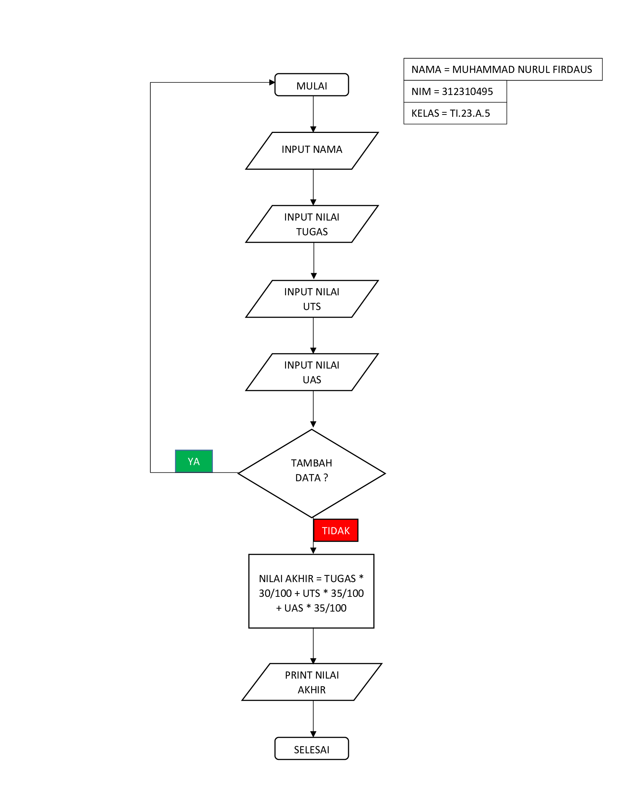
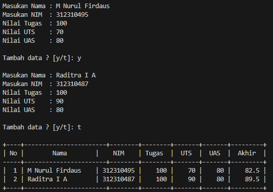

# Buat program sederhana untuk menambahkan data kedalam sebuah
## List dengan rincian sebagai berikut:
* Progam meminta memasukkan data sebanyak-banyaknya (gunakan perulangan)
* Tampilkan pertanyaan untuk menambah data (y/t?), apabila jawaban t (Tidak), maka program akan menampilkan daftar datanya.
* Nilai Akhir diambil dari perhitungan 3 komponen nilai (tugas: 30%, uts: 35%, uas: 35%)
* Buat flowchart dan penjelasan programnya pada README.md.

## Flowchartnya:



## Programnya:
``````python
# LIST
nama = []
nim = []
nilaiTugas = []
nilaiUTS = []
nilaiUAS = []
nilaiAkhir = []

print()

# Input
while True:
    nama.append(input("Masukan Nama : "))
    nim.append(input("Masukan NIM  : "))
    Tugas = int(input("Nilai Tugas  : ")); 
    nilaiTugas.append(Tugas)
    UTS   = int(input("Nilai UTS    : ")); 
    nilaiUTS.append(UTS)
    UAS   = int(input("Nilai UAS    : ")); 
    nilaiUAS.append(UAS)

    nilaiAkhir.append(Tugas * 30/100 + UTS * 35/100 + UAS * 35/100)

    print()
    _tanya = input("Tambah data ? [y/t]: ")
    print()
    if(_tanya == "t"):
        break

# Output
print("+----+-----------------------+--------+--------+-------+-------+---------+")
print("| {0:^2} | {1:^18} | {2:^9} | {3:^6} | {4:^5} | {5:^5} | {6:^7} |".format("No", "Nama", "NIM", "Tugas", "UTS", "UAS", "Akhir"))
print("-----+-----------------------+--------+--------+-------+-------+---------+")

no = 0
for nama, nim, Tugas, UTS, UAS, nilaiAkhir in zip(nama, nim, nilaiTugas, nilaiUTS, nilaiUAS, nilaiAkhir):
    no += 1    
    print("| {0:>2} | {1:<18} | {2:>8} | {3:>6} | {4:>5} | {5:>5} | {6:>7} |".format(no, nama, nim, Tugas, UTS, UAS, nilaiAkhir))
print("+----+-----------------------+--------+--------+-------+-------+---------+")
``````
### Outputnya:

